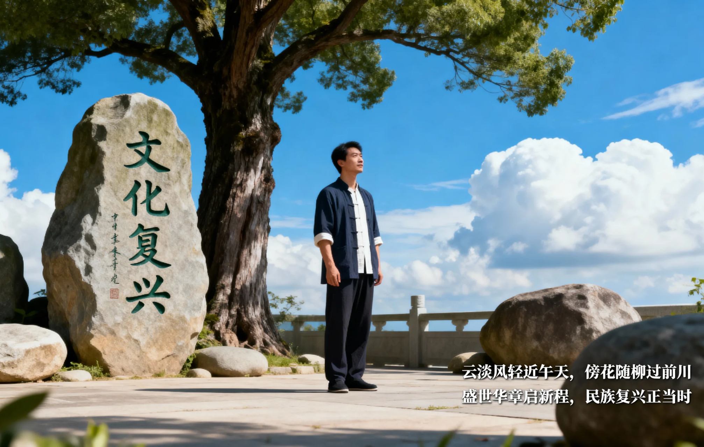

## 楔子：时代的交响，与内心的独奏  
**我们正身处一个气象万千的时代。这是一个信息奔流、万象更新的中国盛世。**科技日新月异，物质丰盈充沛，古老的文明正焕发出磅礴的生机。我们站在前人难以想象的基石之上，拥有安居乐业的保障与追寻个人理想的广阔天空。  
**然而，在这恢弘的交响乐中，我们每个人的内心，是否也奏响了宁静而昂扬的乐章？**深夜的书房里，你熟稔各种效率法则，却依然被最后的截止期限追得心力交瘁；喧闹的聚会散场后，你掌握了无数沟通要诀，却仍被深刻的孤独感悄然包裹；在人生一个又一个“理应满足”的时刻，那份若有若无的空虚与疲惫，为何总如影随形？  
**我们向外建设世界，为何却在自家的心田里，进退失据？**外在的航道前所未有地开阔，内在的罗盘却时常指向迷蒙。这，成了我们这一代人最切身的困惑。  
**“不识本心，学法无益”。这八个字，如穿越千年的钟声，在此刻叩响。**它揭示了一个真相：若找不到内心那如如不动的“定海神针”，所有外在的方法、知识与成就，都如同建在流沙上的城堡，浪潮一来，便摇曳倾颓。  
今天，我们高扬 **“文化复兴”与“文化自信”** 的旗帜，其最深刻的底蕴，绝不仅仅是向典籍深处的回望，更是要让那源头活水般的智慧，在我们每个人的生命之中重新流淌，真正照亮当下的迷惘、焦虑与不安。这份自信，最终必须根植于对自我心性的清醒觉知。  
**这本书，便是一次基于此的探索与实践。**它不承诺提供更多漂浮于表面的技巧，而是邀请你，**共同完成一次生命根本的 “转向”**——从永无休止地对外索取答案，转为向内认识那颗能生万法却常被忽略的 “本心” 。  
现在，请你暂且放下对“更多、更快、更强”的惯性追逐，安住于此地此刻。让我们一起，凭借祖先传承的智慧灯盏，依托这个伟大时代赋予我们的底气与从容，开启这段最重要的旅程——**向内，认识你自己。唯有心安，方能行稳致远。**  
  
