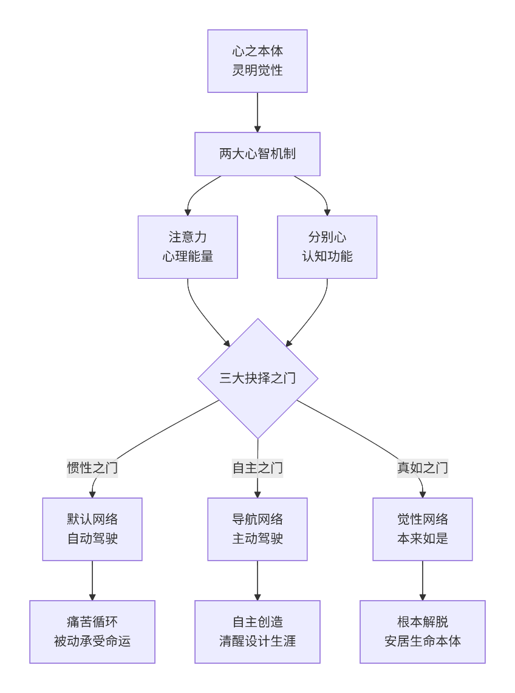
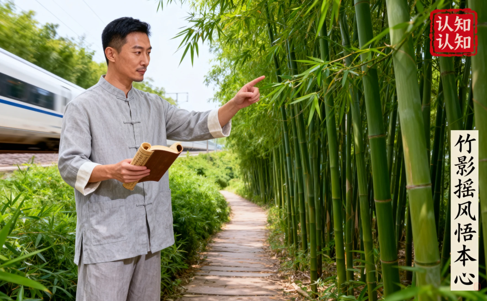
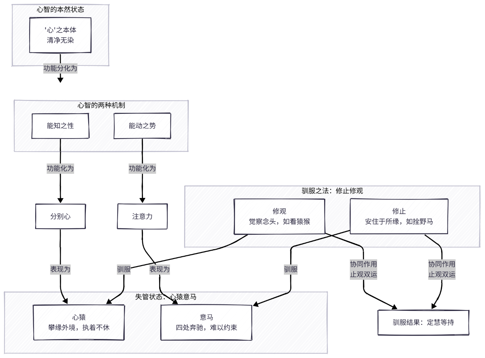
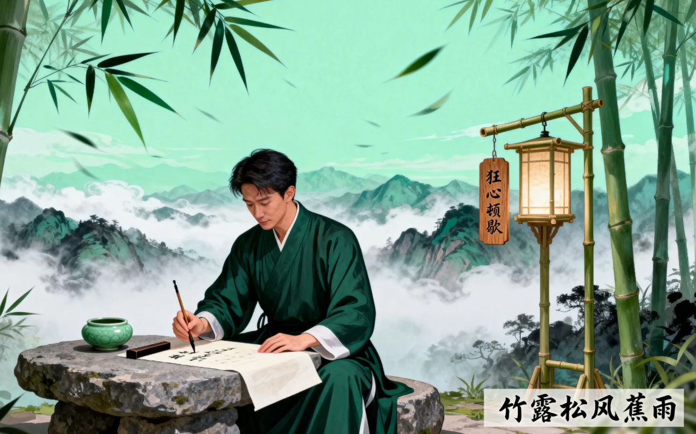
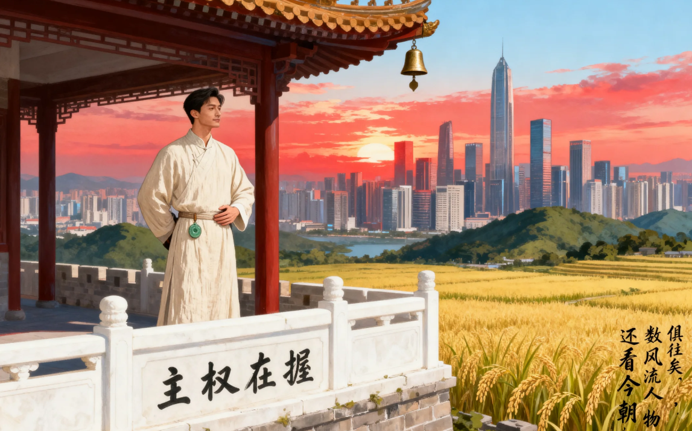
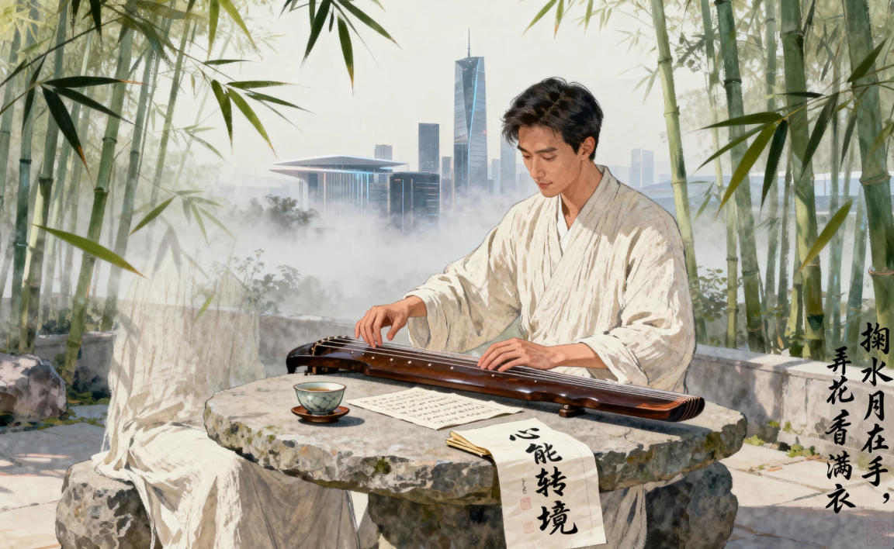

## 序言：开启心智觉醒之旅
### 1. 心智模式：认识你自己
亲爱的朋友：当你翻开这本书时，我想邀请你一同思考：**为什么我们懂得那么多道理，却依然过不好我们的一生？**为什么学习了各种方法，却还是会在相同的困境中打转？  
**答案**就藏在**我们从未真正了解**过的——**心智运作的规律**中。  

经过多年的修行体证，我总结出了一套完整的《**心智论》模型**，它可以用下面这张图来完整呈现：

这个**心智模型**包含四个核心组成部分：  
**1.【一心 · 源起与归处】**  
一切心智现象的源起与归处，皆在于那如如不动的**真心**。它是内在最深湛的海洋，浩瀚而宁静。所有浮现的思维浪花与情绪波涛，都从这片觉性之海中升起，也终将消融回它的怀抱。  
**2.【二机制 · 运作与转化】**  
心智的运作，依赖两种根本机制，如同真心晴空下的并生双翼：  
- **注意力的能量之河**：无觉知时，河水漫溢，即为**妄想**；觉醒收摄，汇入专注河道，便升华为行动无碍的**成所作智**。
- **分别心的认知之镜**：无明遮蔽时，镜面染尘，便生**执着**；拭去尘垢，恢复明晰，即化为观照实相的**妙观察智**。

转念之间，枷锁脱落，我们便回到了本自自在的家园。  
**3.【三门 · 抉择与契机】**  
在意识长河的每一个当下，都存在着根本的蜕变契机。你将清晰地看见：  
- 踏入**惯性之门**，便滑入过去的河道，被动重复。
- 跃入**自主之门**，便开始亲手塑造新的流向，主动创造。
- 融汇**真如之门**，便是当下顿悟——你本是那无垠的海洋，包容万流，如如不动。

**4.【三网 · 状态与家园】**  
心智的三种基本网络，在生命之河中次第展开：  
- 我们时而漂浮于**默认网络**，被过往习气牵引，在惯性的漩涡中徘徊。
- 时而又能踏上**导航网络**的岸堤，以清明的觉知审视流向，做出清醒的抉择。
- 而这一切，最终都汇入并消融于**觉性网络**的广阔海洋——它超越选择，是我们本自安居的真实面目。

**认识你自己，是拿回生命主动权的开始——这本心智地图，正是为你照亮归途的心灯。**  
### 2. 全部奥秘：认知的认知
我们平日所说的 **“心、意、识”** ，正是解构你全部内在世界的三把钥匙：  
- **心**：是你如如不动的**真心本体**，是能知能觉的背景本身，如同浩瀚晴空。
- **意**：是你奔腾不休的**注意力**，是心理能量的流向，如心猿意马，散乱攀援。
- **识**：是你不断分别评判的**分别心**，为一切经验贴上标签，编织故事的剧本。

你熟悉的 **“心猿意马”** ，描绘的正是“意”（注意力）的散乱与“识”（分别心）的纷扰。而那个能清醒**觉察**这一切，却如如不动的，正是你本自清净的 **“心”**。  
**在每一个当下的瞬间，你都站在决定命运的三扇门前**：  
- **惯性之门**：带你无意识地重复过去的剧本，活在由习气驱动的**默认网络**中，结果是痛苦的循环。
- **自主之门**：让你清醒地夺回主导权，运用**导航网络**进行观察与创造，结果是内心的稳定与智慧。
- **真如之门**：让你直接安住于**觉性网络**，与本体合一，体验根本的自在与解脱。

**你的命运，从非注定。**  
它正是你在每一个这样的瞬间，**选择推开哪一扇门、活在哪一种状态中**所自然累积的结果。了解这一点，你便拿回了生命的主动权。  
**这便是最高阶的觉察——对认知本身的认知。**你的命运画卷，正是由这一系列内在的认知抉择，层层挥毫，最终展开的全然不同的生命风景。  

### 3. 心猿意马：狂心顿歇
**“心猿意马”**  
这个成语，极其精妙地概括了心智的两种核心机制——**“分别心”** 与 **“注意力”**——在未被驯服时的根本状态。  
它并非一个简单的比喻，而是对心智运作模式的深刻洞察。下图揭示了其内在的对应关系与驯服之道：  

**1、 心猿 → 分别心 （认知功能）**  
**特性**：猴子活泼好动，一刻不停，从一棵树跳到另一棵树，从一根藤蔓摆到另一根藤蔓。  
**对应**：这形象地描绘了我们的**分别心**。  
- **攀缘外境**：如同猴子在树林中攀爬抓取，我们的心也不断地“攀缘”和“抓取”外界的色、声、香、味、触、法，并对其进行识别、分类、评判（“这是好的”、“那是坏的”、“这是我的”、“那是他的”）。
- **执着不休**：猴子抓到东西就不愿放手。同样，我们的分别心会对喜欢的境界产生“贪”（执着不放），对讨厌的境界产生“嗔”（排斥抗拒），内心永无宁日。

**2、意马 → 注意力 （心理能量）**  
**特性**：野马奔腾不息，力量强大但方向不定，难以驾驭，稍有惊吓便会狂奔。  
**对应**：这精准地描述了我们的**注意力**。  
- **四处奔驰**：我们的心理能量（注意力）就像脱缰的野马，被分别心产生的每一个念头、情绪所牵引，从一个想法跑到另一个想法，从过去跑到未来，散乱无序，无法安住于当下。
- **难以约束**：没有经过训练的心，其注意力是软弱且不受控制的。我们本想专注工作，但念头（心猿）一闪，注意力（意马）立刻就跟着跑了，消耗在无尽的内心戏和情绪波动中。

**描述了一种失控的状态**：“心猿意马”描述的正是我们心智的**默认网络**主导时的状态。在此状态下，我们不是心的主人，而是分别心（猿）和注意力（马）的奴隶，被它们拖着在生死烦恼中狂奔。  
**指出了修行的核心**：整个修行的过程，就是 **“降伏其心”** 的过程，也就是 **“锁心猿，拴意马”**。  
- **修“止”** 就是**拴意马**。通过训练，将散乱的注意力（野马）收回，安住于一个目标（如呼吸、佛号），使其变得专注、稳定、可控，从而产生 **“定力”**。
- **修“观”** 就是**锁心猿**。以稳定的注意力为基础，去清醒地觉察分别心（猿猴）的来来去去，而不被其拐跑，从而生起 **“慧力”**。

因此，“心猿意马”不仅仅是一个形容词，它更是一张**心智的解剖图**和一份**修行的路线图**。它告诉我们问题出在哪里，也指明了对治的方向——**通过“止观”的修炼，驯服猿马，让狂心顿歇，回归本心的宁静与清明。**  

### 4. 目光所向：主权在握
常说**“目光所在，生命所向”**。这“目光”，正是你最珍贵的心理能量——**注意力**。它如同你生命的探照灯，你所照亮之处，便构成了你世界的全部现实。  
而在信息海啸的今天，你的注意力已成为最**稀缺的资源**，无数力量都在争抢你这盏“探照灯”的控制权。与此同时，你那时刻评判的**分别心**，则如同一个高速运转的“意义过滤器”，为探照灯捕获的每一束光瞬间贴上“重要/无聊”、“喜欢/厌恶”的标签。  
这两者协同，便为你编织出独一无二的人生现实：  
- 你的**注意力**投向哪里，你的情感、记忆和体验就在哪里扎根；
- 你的**分别心**如何评判，就决定了你是在那片土壤中培育出花园，还是滋生出荆棘。

**于此分野，人生道路截然不同**：  
- 若你任由注意力被算法劫持，让分别心沉浸在比较与焦虑中，生命便会在被动反应与内心耗竭中展开。
- 当你**收回注意力的主权**，并让分别心从自动化评判转为**清明的观察**，你便夺回了生命的画笔——开始有选择地将光芒投向真正滋养你的事物，并以智慧重新定义你所经历一切的意义。

在这个时代，守护并善用你的注意力与分别心，已不仅仅是提升效率的技巧，更是**捍卫你生命主权、活出真正深度的修行。**  

### 5. 信息海啸：心能转境
信息海啸何曾为敌？一切外境，无非是你心内“二机制”的试金石与磨刀石。  
- **注意力**若散乱，海啸便是吞噬你的巨浪；**注意力**若清明，海啸便是载你远航的潮汐。
- **分别心**若执着，万象皆是困住你的牢笼；**分别心**若智慧，万象皆是觉醒你的道场。

切莫怨天尤人。今天，正是亘古未有的**黄金时代**：  

全球命运交织成网，文明智慧触手可及；祖国正迈向伟大的复兴，为我们提供了最坚实的依托。  
**“中土难生今已生，人身难得今已得，佛法难闻今已闻。”**  

一切最珍贵的助缘，都已为我们准备齐全。  
此刻，只待最后一事：**愿你掌握此心智模式，清醒勇猛地回归内在的家园，同时，将这份觉醒的光明，炽热地回馈于我们深爱的国土。**  

### 6. 完整地图：六部归程
**回到当下，也许你正在经历**：  
- 情绪的漩涡让你疲惫不堪
- 念头的洪流让你难以安宁
- 关系的困境让你感到无力
- 命运的重复让你心生困惑

**这不是你的错，而是因为你还没有掌握心智运作的根本规律**。  
更重要的是，你不知道在每个关键的时刻，其实都存在着**三扇门的选择**——只是我们往往习惯性地推开了那扇熟悉的**“惯性之门”**。  
**不识心智，修行无门；不知三门，难以转境。**  
这本书将带你系统地认识并掌握自己的心智：  
- 在**第一部**，我们将看清默认网络的运作机制，明白推开**“惯性之门”**的痛苦后果。
- 在**第二部**，我们将认识真心的本来面目，明白**“自主之门”**和“**真如之门”**的存在。
- 在**第三部**，我们将通过具体训练，学习如何有意识地推开“自主之门”。
- 在**第四部**，我们将体验推开“真如之门”的自在，品尝觉醒的滋味。
- 在**第五部**，我们将把觉醒智慧应用于关系、教育、财富等生活各个领域。
- 在**第六部**，我们将完成从自利到利他的升华，成为生命的清醒创作者。

本书的独特之处在于：  
- **体系完整**：基于心智论模型，六部曲环环相扣
- **知行合一**：每个理论都配有具体可行的实践方法
- **根源着手**：不是在外围打转，而是直指心智根本
- **现代表达**：用当代语言诠释古老智慧，易懂易行

现在，请你带着一颗开放的心开始这段旅程。不必急着追求结果，不要执着于文字概念。真正的转变，发生在你将这套心智模型化为己用的过程中。  
愿这本书成为你心智觉醒的助缘，但请记住：**所有的方法都只是工具，真正的智慧一直都在你的心中，等待被唤醒**。  
准备好了吗？让我们一起开启这段心智觉醒的旅程。  
