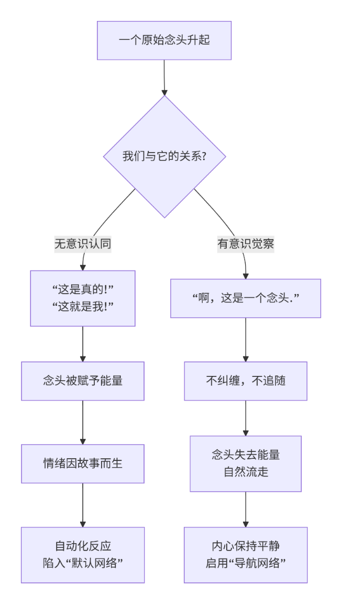

## 第一部：困局 · 识得庐山真面目
**导读：我们总想改变命运，却从未看清那编织命运的手——我们自己的心智**。  
### 第一章 无声的风暴：当你的头脑成为你的敌人
**导读：在解决问题之前，先要看清问题。让我们举起觉察的探灯，照亮内心这场“无声的风暴”**。  
#### 1.1 情绪的漩涡：为何我们总在同样的剧情里跌倒？
情绪，本是生命最直接的脉动，如天空中的云彩，自然生起，也应自然消散。它本身从不构成问题。问题在于，我们常常从一个本可“经历情绪”的体验者，**跌落**成一个“被情绪占据”的囚徒。这个看似不由自主的“跌落”过程，便构成了我们每个人最为熟悉的“情绪漩涡”。  
这个漩涡并非神秘莫测，它有其精密的、可被观察的内在结构。看清这个结构，是走出漩涡的第一步。  
**情绪漩涡的精密构造**：  
| **漩涡层级** | **它对你的内在操控** | **你的真实体验** | **心智状态** |
| --- | --- | --- | --- |
| **1. 外在触发** | 一个事件发生（他人一句话，一个意外） | “刚才那件事，是什么意思？” | **默认网络**被激活，警觉升起 |
| **2. 身体反应** | 生理能量瞬间改变（心跳加速、肌肉紧绷） | 一种莫名的“不对劲”感在身体弥漫开来 | 身心连接被忽视，能量开始紊乱 |
| **3. 故事编辑** | 头脑自动编撰“剧情”：他不尊重我/我搞砸了 | 思绪飞转，不断寻找证据支持这个“故事” | **分别心**高速运作，贴上负面标签 |
| **4. 身份认同** | 从“我感到了愤怒”滑向“我就是个愤怒的人” | 整个自我认知被情绪故事笼罩、固化 | **注意力**完全被故事捕获并锁死 |
| **5. 自动化反应** | 在“剧情”和“身份”驱动下，言不由衷，行不由心 | 像被按下开关的机器人，做出习惯性反应 | **惯性之门**彻底洞开，循环完成 |

这张表格揭示了一个核心真相：**我们一次次跌倒的，从来不是那个外在的“坑”，而是这个内在的、自动化运行的“心理程序”**。 只要这个“默认程序”不被我们觉察和修改，无论换多少人、多少事，我们都会以同样的姿态，跌倒在名字不同但本质相同的“剧情”里。  
**一个瞬间的暂停：从漩涡中抽身**  
要打破这个循环，我们无需在漩涡中与之搏斗。我们只需要在它启动的早期，创造一个“瞬间的暂停”。  
下一次，当情绪的苗头刚刚升起，无论大小，请尝试这样做：  
- **中断叙事**：轻轻地对自己说：“停，一个故事又开始了。”
- **回到身体**：将注意力从头脑的剧情，转向身体的感受。问自己**：“这个情绪，在我身体的哪个部位感受最强烈**？”（是胃部的紧缩？喉咙的堵塞？还是心口的灼热？）
- **只是感受**：**仅仅将你温柔的注意力，像一个探照灯一样，投向那个身体部位，感受那里的能量，不做任何分析和评判**。

这个简单的动作，就像在汹涌的漩涡中投入了一根“定海神针”。它让你从头脑编织的虚拟“故事”中，抽身回到身体的真实“感受”上来。仅仅是这个“转向”，你就已经为你的人生，推开了一扇全新的门——我们稍后会详述的“自主之门”。  
然而，情绪的风暴并非凭空而来。它需要燃料。这燃料，便是我们下一节要探访的、那永不停歇的“念头洪流”。它，正是那个在幕后不断“编辑故事”的编剧。  
上一节，我们探明了“情绪漩涡”的精密结构，并找到了一个关键的破解之法：**回到身体的感受，中断头脑的叙事**。这个方法之所以有效，正是因为它切断了情绪风暴最重要的燃料供给。现在，是时候去拜访那位永不停歇、在幕后不断编织故事的“燃料供应商”了。  
#### 1.2 念头的洪流：那个永不停歇的“后台评论员”
请你现在，安静一秒钟，只是单纯地倾听你的头脑。  

你听到了什么？  
是不是有一些声音，一些词句，一些图像，正在不断地冒出来？也许是在评判这段文字，也许是在计划晚饭，也许是一段回忆的闪回，也许是对未来的担忧……  
这就是我们所要谈论的——**念头的洪流**。它如同一条永不冻结的河流，日夜不息地在我们的心智中流淌。它，就是那位我们无比熟悉，却很少真正认识的“后台评论员”。  
**这位“评论员”有几个核心特征**：  
- **自动化**：它的出现不受你的控制，就像天空飘过的云，不知从何而来。
- **持续性**：只要你在清醒状态，它几乎永不间断，从一个话题跳到另一个话题。
- **认同性**：它通常以“我”为主语（“我认为”、“我觉得”、“我应该”），让我们不假思索地认为“这就是我的想法”。

我们与这位“评论员”的关系，决定了我们生命的质量。绝大多数时候，我们与它的关系是**无意识的融合**。我们相信它说的每一个故事，把它对过去的解读当作事实，把它对未来的预言当作真相。  
这个过程，可以清晰地用下图来揭示：

  

这张图揭示了一个根本性的转变：**痛苦并非源于念头本身，而是源于我们对念头的“认同与纠缠**”。  
**如何从“洪流”中上岸？——“标注”的智慧**  
当我们站在河边，被湍急的水流（念头）弄得头晕目眩时，最好的方法不是跳进去与之搏斗，而是**后退一步，观察并标注它**。  
这是一个比“回到身体”更进一步的练习，它直接处理念头本身。  
- **当你陷入对过去的反刍时**，在心里轻轻地标注：“**回忆正在发生**。”
- **当你陷入对未来的担忧时**，标注：“**计划（或担忧）正在发生**。”
- **当你开始评判某人时**，标注：“**评判正在发生**。”
- **当你被一个念头紧紧抓住，深信不疑时**，尤其要标注：“**一个故事正在被相信**。”

这个“标注”的动作，看似简单，却具有强大的力量。它瞬间在你和你的念头之间，创造了一个宝贵的 “**观察的距离**” 。你不再是那个**是**念头的人，而是那个**拥有**念头，并能**观察**念头的人。你从舞台上的演员，变成了台下清醒的观众。  
念头或许不会因此停止，但它失去了强制你服从的魔力。你，夺回了一丝主权。  
然而，无论是情绪的漩涡，还是念头的洪流，它们之所以能持续消耗我们，都需要一种最基本的“能量”。这种能量是我们最宝贵的生命资源，而它，正在我们毫无察觉的情况下被大量浪费。这便是我们下一节要探讨的，最无形也最深刻的消耗——**注意力的散失**。  
**本节思考与感受**：  
- 尝试做一分钟的“观察者”，只是看着念头来来去去，并轻轻地标注它们（例如：“一个声音……一个图像……一个计划”）。这与你平常沉浸于思考的状态，感觉有何不同？
- 你是否能回忆起一个时刻，你因为相信了一个念头（比如“他肯定是讨厌我”），而产生了不必要的痛苦？  

上一节，我们认识了那位永不停歇的“后台评论员” ——念头的洪流，并学会了通过“觉察”与“不认同”来创造观察的距离，从而削弱它的控制力。然而，无论是情绪的漩涡，还是念头的洪流，它们若要持续肆虐，都必须消耗一种最基本的生命能量。现在，我们就来到这场风暴的根基处，审视我们最宝贵的内在资源是如何被无声窃取的。  
#### 1.3 疲惫的根源：能量都去了哪里？——注意力的无形消耗
请你感受一下，在经历了一场情绪风暴或长时间的思虑后，你的身体和内心是一种什么状态？答案很可能是：**疲惫**。  
这种疲惫，往往并非来自体力劳动，而是一种深层的、精力的枯竭感。它的根源，便是我们心智中最核心的资源——**注意力** ——被大量地、持续地无效耗散。  
**注意力，就是你的心理能量，是你生命的“本钱**  
”。它本应是你用来体验世界、创造生活、连接他人的光。但在惯性模式的自动运行下，这束光却像一支被随意挥舞的手电筒，大部分光能都浪费在了照亮虚无的过去和幻象的未来上。  
我们可以通过一个简单的“注意力清点”来看清这一点。请对照下表，评估你注意力消耗的主要去向：  
| **注意力消耗渠道** | **具体表现** | **结果与代价** |
| --- | --- | --- |
| **1. 反刍过去** | 不断回放尴尬场景、未解决的冲突、曾经的损失。 | 活在过去的阴影中，消耗当下解决问题的能量。 |
| **2. 担忧未来** | 预演可能出现的失败、灾难化的想象、无尽的“要是…怎么办”。 | 活在未来的焦虑中，无法有效规划，被恐惧瘫痪。 |
| **3. 评判当下** | 对眼前的人、事、物不停地贴上“喜欢/讨厌”、“好/坏”的标签。 | 制造内在的冲突与对立，无法如实地经验当下。 |
| **4. 维持伪装** | 耗费心力维持一个“应该”的形象，压抑真实的情感和需求。 | 导致内在分裂与疲惫，远离真实的自我。 |
| **5. 被动反应** | 注意力被外界信息（如推送、新闻、他人情绪）不断抓取、牵扯。 | 失去自主性，精力被碎片化，感到失控与烦躁。 |

这张清点表揭示了一个令人震惊的事实：**我们绝大多数人，都在用自己最宝贵的生命能量，去喂养那些让我们痛苦的心理活动**。  
**一个根本的转变：从“被动消耗”到“主动投资”**  
解决之道，不在于“努力休息”，而在于 “**有意识地将注意力从不必要的消耗中撤回**” 。这并非压抑念头或情绪，而是不再为它们提供持续的能量供给。  
**练习：注意力回收——找到你的“内在支点**”  
这个练习是前面“回到身体”和“觉察念头”的深化与整合，旨在直接回收你的心理能量。  
- **觉察消耗**：在一天中，随时留意你的注意力是否陷入了上表中的某种消耗渠道。一旦觉察，温柔地承认：“啊，我的能量正在被消耗。”
- **中断供给**：轻轻地做一个决定：“现在，我选择不再喂养这个想法或情绪。”
- **转向支点**：**将你的注意力，像转移一笔宝贵的资金一样，从一个亏损账户，转向一个稳定的“内在支点**”。最常用、最有效的支点就是你的**身体感觉**，特别是：
- **呼吸的感觉**：感受鼻腔的空气进出，或腹部的起伏。
- **脚踏实地的感觉**：感受双脚与地面接触的坚实触感。
- **手的触感**：感受手指相触，或手放在腿上的温度和压力。

你不需要改变呼吸，也不需要改变姿势，只是去**感受它**。这个简单的动作，就是在完成一次最重要的能量转移**：从虚幻的心智剧情，转向真实的身体当下**。  
每一次你这样做，你都是在为自己疲惫的心灵“止血”，并重新积蓄能量。你开始从一个能量的“被动消耗者”，转变为自己能量的“主动管理者”。  

通过本章的探索，我们清晰地看到了“无声风暴”的三个层面：情绪的漩涡、念头的洪流，以及最深层的注意力消耗。它们共同构成了我们痛苦与疲惫的根源。然而，看清困局本身，就已经照亮了出路。在下一章中，我们将跳出单一事件的视角，从更高层面审视这个让我们不断轮回的、完整的 “**命运自动驾驶系统” ——默认网络**。  
**本节思考与感受**：  
- 根据“注意力清点表”，你发现自己的心理能量主要被哪一两种渠道消耗得最多？
- 尝试做三次“注意力回收”练习。在将注意力转向“内在支点”后，你内心的疲惫感或混乱度是否有细微的变化？
