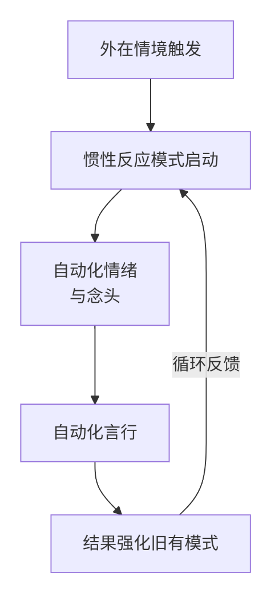

### 第二章 迷宫的基石：默认网络——命运的自动驾驶
**导读：是时候走进控制室，看清那个预设了我们反应模式的“自动导航系统”了**。  
在上一章中，我们细致地拆解了内心“无声风暴”的三大组成部分：消耗能量的**情绪漩涡**、编织故事的**念头洪流**，以及作为这一切根基的**注意力耗散**。我们学会了通过“回到身体”和“标注念头”来瞬间抽离，这如同在惊涛骇浪中找到了暂时的浮板。  
然而，要想真正结束这场风暴，我们必须超越对单一浪头的应对，去理解整个海洋的运作规律。现在，就让我们一同来审视这个在背后主导着我们绝大多数思想、情绪和行为的，看不见的自动操作系统。  
#### 2.1 何为“默认”？——过去的总和，未来的预言
请你观察自己一天中的行为：从早上醒来伸手拿手机，到对同事一句玩笑的习惯性反应，再到晚上无意识地刷剧度日……这其中，有多少是你真正**有意识的选择**，又有多少，仅仅是一种**自动化的发生**？  
那个让你在类似情境下，产生类似反应，并导致类似结果的、无形的推动力，就是我们所说的 “**默认网络**”。  
它并非一个实体器官，而是你心智中一个稳定运行的**系统**，是过去所有习气、经验、思维模式和情绪反应的**总和**。它就像一个公司里那套庞大、陈旧，却在日夜不停自动运行的“后台操作系统”。为了让你更清晰地理解这个系统，请看其运作机制的核心剖析：  
| **核心部件** | **功能描述** | **与第一章的关联** |
| --- | --- | --- |
| **1. 核心指令：维持“我**” | 其根本功能是维护一个“独立的、连续的自我感”，并通过不断评判和反应来巩固此感觉。 | 这是**身份认同**（1.1节）的根源。 |
| **2. 数据库：过去的一切** | 储存了你所有的记忆，尤其是带有强烈情绪印记的“未完成事件”，作为当下反应的参考模板。 | 这是**反刍过去**（1.3节）的素材库。 |
| **3. 运算逻辑：惯性模式** | 一套固定的“如果…就…”反应程序。例如：“如果被否定，就感到愤怒并反击”。 | 这是**自动化反应**（1.1节）的程序编码。 |
| **4. 能量来源：你的注意力** | 它本身没有能量，必须捕获你当下的心理能量（注意力）才能启动并运行。 | 这正是**注意力消耗**（1.3节）的终极去向。 |
| **5. 输出结果：情绪与念头** | 系统运行后，自动输出的产品就是你所体验到的情绪漩涡和念头洪流。 | 这便是**情绪**（1.1节）与**念头**（1.2节）的源头。 |

**这个系统，就是你命运的“自动驾驶”模式**。  
当你无意识地活在默认网络中，你的人生就呈现出一种“轮回”的特质——类似的问题反复出现，类似的烦恼不断重演。你感觉自己努力了，改变了，却总在某个节点被一股无形的力量拉回原处。这股力量，就是惯性，在古老智慧中，它被称为“业力”。  
它就像一座你无比熟悉的、无形的迷宫。你在这座迷宫中生活了太久，以至于把墙壁的触感当成了世界的全部。你以为你在自由地思考、选择和行动，但实际上，你只是在迷宫中，沿着预设的、有限的路径来回打转。  
**一个根本的洞察**：  
**你，并不等同于你的“默认网络**”。  

你，是那个能够**觉察**到这个网络在运作的**觉知本身**。  
这个洞察，是打破轮回的开始。当你意识到“啊，我的默认网络又启动了”，你就已经不再是它完全操控下的傀儡。你与它之间，出现了一个珍贵的缝隙。在这个缝隙里，蕴含着真正的自由与选择。  
而这道缝隙，就是我们下一节将要探索的，从自动驾驶切换到手动驾驶的那个关键按钮——“**门”的抉择**。  
**本节思考与感受**：  
- 回顾今天或昨天，你是否能清晰地辨识出一个被“默认网络”主导的时刻？当时的具体反应模式是什么？
- 当你想到“你并不等同于你的默认网络”时，内心有什么样的感受？是感到一丝解脱，还是有所困惑？  

在上一节中，我们认识了那个塑造我们命运的“自动驾驶系统” ——默认网络。我们看清了它的构成，也体验到了被它掌控时的那种“轮回”之感。这或许会让你感到一丝沉重，但请记住，看清迷宫本身，正是为了找到走出迷宫的地图。  
而这张地图上最关键的标识，并非一条遥远的道路，而是一扇**无处不在、触手可及的门**。它就在你心智的每一个转角处，等待着你的推开。  
#### 2.2 走出迷宫的第一扇门：从自动驾驶到手动驾驶
在默认网络的惯性洪流中，我们并非毫无还手之力。我们与自由意志之间，并非隔着一道高墙，而是隔着一扇**门**。  
这扇“门”，不是一个物理存在，而是心智在运作中一个**瞬息的抉择点**。它发生在刺激与反应之间那个短暂的空隙里。正如心理学家维克多·弗兰克尔所言：“在刺激与反应之间，有一个空间。在那个空间中，是我们选择反应的力量和自由。”  
这扇门，通常以三种方式存在，而你的命运，就取决于你习惯性地推开哪一扇：  
| **门的类型** | **核心特征** | **你的状态** | **结果** |
| --- | --- | --- | --- |
| **惯性之门** | 无意识、自动化。被过去的习气推动。 | “不得不如此…”、“我又这样了…” | 陷入默认网络，重复痛苦循环。 |
| **自主之门** | **有意识、有选择**。此刻的清醒决定。 | “我选择…”、“我可以试试不同的方式…” | 启动导航网络，开创全新可能。 |
| **真如之门** | 超越主客、自然无为。智慧的自然流露。 | “本来如此…”、“安然自在…” | 安住觉性网络，体验根本自在。 |

对于当下的我们而言，最现实、最有力的，就是学习去识别并推开那扇 “**自主之门**”。  
**如何识别“自主之门”出现的瞬间**？  
它通常出现在以下这些时刻：  
- 情绪即将爆发，但还未爆发的那个**临界点**。
- 一句伤人的话即将冲口而出的**前一秒**。
- 感到焦虑，下意识要拿起手机刷屏的**那个冲动**。
- 一个熟悉的负面念头升起，你快要相信它的**那一刻**。

在这些瞬间，你通常会感到一种内在的**紧绷感和拉扯感**。那正是“惯性”在拼命拉你走老路，而你的“觉知”正在微弱地发出信号。这个信号，就是“自主之门”出现的铃声。  
**练习：推开通往自由的第一扇门**  
现在，我们来进行一个至关重要的练习，它将是本书后续所有训练的基石。  
- **识别信号**：在一天中，留意上面提到的那些“临界点”。当你感到内在的拉扯时，在心里轻轻地说：“**门，出现了**。”
- **创造停顿**：不要立刻行动。刻意地**暂停**一下。哪怕只是深呼吸一次，或者在心里默数三秒。
- **做出选择**：在这个停顿创造出的宝贵空间里，问自己一个简单的问题：“**在此刻，我最智慧的选择是什么**？”
- 是继续被情绪带走？
- **还是**，我可以先把注意力收回来，感受一下我的呼吸？

你不需要做出多么伟大的选择。**仅仅是有意识地选择“暂停并感受呼吸”，你就已经成功地、彻底地推开了那扇“自主之门”**！ 因为这一举动本身，就标志着你的心智从“默认”的自动驾驶，切换到了“导航”的手动驾驶。  
你，已经不再是那个被动的乘客，你握住了方向盘。  
然而，推开这扇门需要力量。我们常常心有余而力不足，感觉门后有千钧重物在阻挡。这股阻挡我们的强大力量，就是下一节我们要正视的——驱动着默认网络的 “**惯性力**”。  
**本节思考与感受**：  
- 在今天，你是否成功捕捉到了一个“门”出现的瞬间？那个瞬间的内在感受是怎样的？
- 如果你尝试了“推门练习”，哪怕只有一次，推开“自主之门”与跟随“惯性之门”的体验，有何不同？  

上一节，我们找到了那个改变命运的支点——“自主之门”，并学会了在情绪和念头的临界点，通过“暂停”与“选择”来推开它。这标志着我们从“默认网络”的自动驾驶，开始转向“导航网络”的手动驾驶。  
然而，每一次推开门，我们几乎都能立刻感受到一股强大的、反向的拉扯力。它就像地心引力，试图将我们拉回熟悉的轨道。这股力量，并非来自外界，而是来自我们内在最深的积习——它就是驱动整个默认网络的引擎：**惯性力**。  
#### 2.3 惯性力：业风鼓动，身不由己
在古老的东方智慧中，这种力量被称为“业力”。抛开宗教色彩，我们可以将其精要地理解为一种心理上的**惯性**。就像物理世界中的物体具有保持运动状态的惯性一样，我们的心智也具有保持其固有思维、情绪和行为模式的强大倾向。  
这种惯性力，并非神秘莫测，它可以通过一个清晰的循环来理解：  
**过去的印记（因） → 当下的重复（缘） → 固化的习惯（果）→ 更深的印记.**..  
这个循环不断滚动，就像雪球从山坡滚下，越滚越大，最终形成一股看似无法阻挡的力量。这就是为什么我们明明知道很多道理，却依然过不好这一生——**知道是意识层面的，而惯性是潜意识层面的，后者的力量要强大得多**。  
我们可以通过下图，看清这股力量是如何在一个具体情境中运作的：
**如何扭转惯性力？——从“知道”到“证到”**  
要改变惯性，并非依靠意志力与之正面抗衡。恰恰相反，蛮力的对抗往往会使惯性更强，如同在漩涡中挣扎，只会下沉得更快。真正有效的方法，是运用我们刚刚学会的“自主之门”，在其中注入一种全新的力量——**觉察力**。  
**练习：做惯性之流的观察者**  
这个练习是“推门练习”的深化。当惯性反应启动时，尝试不做评判，只是观察：  
- **识别惯性**：当熟悉的模式出现时，在心里轻轻命名：“这是惯性。”
- **感受能量**：将注意力转向身体，去感受这股惯性力在身体里具体的感觉（是躁动？紧绷？还是沉重？），只是感受，不抗拒、不跟随。
- **允许其流过**：像观察河水一样，看着这股带着念头和情绪的能量流经你，信任它来了，也必然会走。

这个“观察”的过程，本身就是在为惯性之力“松绑”。你不再为它加油，也不再紧握方向盘与之搏斗，你只是松开手，看着它。如此一来，惯性的力量就会因为失去你注意力的能量供给，而逐渐减弱。  
**一个重要的希望**：  
请不要因为看清了惯性的强大而气馁。恰恰相反，认识到这一点，是获得真正自由的第一步。因为，**一旦你看到了它，你就已经不再是它了**。 你从“被惯性力推动的物体”，转变为了“能够观察和了解这股力量的觉知”。  
这股看似强大的业风，只有在无明的黑暗中才能肆意鼓动。当“自主之门”中透出的觉察之光照射进来时，它的力量便开始消散。  

通过本章的探索，我们完成了对“困局”的全面审视：从风暴的现象（情绪、念头、注意力耗散），到风暴的系统（默认网络），再到系统的驱动力（惯性力），以及最关键的解方——“**自主之门**”。  
现在，地图已然在手。从下一章起，我们将正式开启全新的旅程，进入**第二部：地图 · 云在青天水在瓶**，去探寻我们那本自具足、如如不动的真心本体。  
**本节思考与感受**：  
- 在你自己的生活中，你是否能识别出一个由强大惯性驱动的习惯（无论是思维、情绪还是行为）？
- 尝试用“观察者”的练习去面对一次惯性冲动，与以往对抗或顺从的方式相比，体验有何不同？
