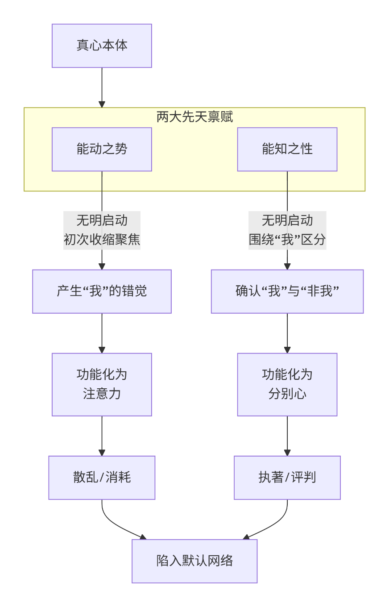

## 第二部：地图 · 云在青天水在瓶
**导读：在一切风暴之下，是一片从未被扰动的深海。那就是你**。  
在上一部的终章，我们找到了打破惯性循环的“自主之门”，手握了从迷宫脱身的钥匙。此刻，我们正式踏入一个全新的领域，不再仅仅剖析问题，而是开始探寻那真正清明、自主、自在的生命本源。  
### 第三章 心智的运作机制：从禀赋到功能
**导读：纯净的能量如何变成困扰？神圣的禀赋如何沦为枷锁？让我们从源头看清心智的运作**。  
#### 3.1 源头活水：认识你本来的面目
当我们被情绪的波涛和念头的乌云困扰时，往往忘记了一个最简单却最根本的事实：**乌云之上，天空永远湛然；波涛之下，深海始终宁静**。  
这片天空，这片深海，就是我们要认识的"真心" ——你生命中最根本的灵性存在，佛陀所说的"如来智慧德相"。  
它不是一个需要向外寻求的神秘之物。它，就是你此刻能读、能想、能知的这个**本然的觉性**本身。在它面前，所有的情绪、念头，甚至整个“默认网络”，都只是来来去去的过客。  
为了帮助你更清晰地理解，请看下表对"真心"与"妄心"的对比：  
| **对比维度** | **妄心（默认网络）** | **真心（觉性本体）** |
| --- | --- | --- |
| **本质** | 由念头、情绪、习气组合的心理内容 | 能知这一切的背景觉知本身 |
| **状态** | 变动不居，生灭不已（如波浪） | 如如不动，寂而常照（如大海） |
| **来源** | 因缘和合，由过去经验塑造 | 本自具足，超越一切概念 |
| **你与它的关系** | 你拥有你的念头情绪，但你不是它们 | 你就是它 |
| **功能** | 思考、分析、记忆、评判 | 觉知、映照、容纳、自在 |

**一个直接的体验**：  
现在，请你暂停阅读，感受一下：  

你能看到这些文字，能理解这些含义。这个"能看"、"能知"的本身，它是什么样子？  

它没有形状，没有颜色，没有声音，但它清清楚楚地**在**。它不在你的头脑里，也不在你的身体外，它是一切体验发生的**背景与空间**。  
这个，就是你的真心。它从未离开，就像天空从未离开过乌云，只是被暂时遮蔽了。  
**大海与波浪的比喻**：  
让我们用一个更形象的比喻来理解：  
- **真心，如同浩瀚无垠的大海** ——深沉、宁静、具足一切
- **我们的念头和情绪，如同海面上的波浪** ——形态各异，起伏不定
- **默认网络，就像我们只盯着波浪看**，并坚信“我就是这朵愤怒的浪花”，从而忘记了整个大海的存在

修行，不是要去创造一片新的海洋，而是**从对波浪的认同，转向对大海的体认**。  
然而，这片本自具足的大海，是如何生起万千波浪的呢？这就要从它内在最原初的两种禀赋说起，它们正是我们下一节要探访的——“**能动之势”与“能知之性”**。它们是心智宇宙的起源，是一切故事的起点。  
**本节思考与感受**：  
- 当你尝试去直接感受那个"能看"、"能知"的背景觉知时，你的内心体验是怎样的？
- "大海与波浪"的比喻，是否帮助你更好地理解了"真心"与"妄心"的关系？

上一节，我们如同指认天空一般，初次认识了那个如如不动、能知能觉的**真心本体**。它是我们生命中最深的宁静与背景，是“云在青天水在瓶”中那片无垠的“青天”。  
然而，这片天空并非死寂，它蕴含了生发万有的潜能；这瓶净水也非凝滞，它内在涌动着重力与流动的趋势。同样，我们的真心，也并非一个空洞的“空”，它内在具足两种最原初的、动态的**禀赋** ——正是这两种力量，构成了我们所有心智现象的源头。  
#### 3.2 心智的先天禀赋：“能动之势”与“能知之性”
现在，请你再次感受你的觉知。你不仅能“知道”这些文字，你还能“转动”你的注意力，从文字切换到呼吸，或切换到窗外的声音。  
这个“能转动”的趋势，就是第一种禀赋——“**能动之势**”（在传统智慧中，或称“意”）。它是心本具的、最原初的动能与方向感，是生命活力的根源。  
而那个“能知道”文字、呼吸和声音的明晰性，就是第二种禀赋——“**能知之性**”（或称“识”）。它是心本具的、最原初的照明与认知能力，是生命智慧的根源。  
为了让你更清晰地理解这两者，请看下表的核心剖析：  
| **维度** | **能动之势 （意）** | **能知之性 （识）** |
| --- | --- | --- |
| **根本定义** | 心本具的、原初的动能与方向性。 | 心本具的、原初的照明与认知能力。 |
| **核心属性** | **动力**：活泼、能动、可导向。 | **明性**：清晰、了别、能反映。 |
| **功能比喻** | 如同**手电筒**发出的那束“光柱”，具备方向与能量。 | 如同手电筒的“**照明”功能**，能清晰照亮光柱所及之物。 |
| **初始表现** | 一种无明的“冲动”，开始收缩、聚焦。 | 一种无明的“确认”，开始区分、识别。 |
| **心智机制** | 功能化为 **注意力** （心理能量系统）。 | 功能化为 **分别心** （认知功能系统）。 |
| **正向升华** | 可转化为专注的 **止力** 与 **定力**。 | 可转化为清明的 **观力** 与 **慧力**。 |

**一个重要且根本的洞见**：  
“**能动之势”与“能知之性”，其本身是真心本体的天然属性，是中性的，是智慧与生命的双重基石**。  
问题不出在它们本身，而出在它们**最初的“无明启动**”上：  
- 当“能动之势”在无明中初次收缩、聚焦，便产生了最初“我”的错觉参照点。
- 紧接着，“能知之性”便围绕着这个“我”的参照点，开始区分“我”与“非我”。

于是，纯粹的能量（势）固化为散乱的**注意力**，纯粹的明性（识）固化为执着的**分别心**。心智从此陷入“默认网络”的纠缠中，忘记了它本是的浩瀚大海。  
**练习：直接体验两种禀赋**  
让我们做一个简单的实验，来直接体验这两种禀赋的运作：  
- **体验“能动之势**”：现在**，决定**将你的注意力从文字上移开，去倾听周围最细微的一种声音。感受那个“决定”转向并移动注意力的**内在动力**。那个动力，就是“能动之势”的显化。
- **体验“能知之性**”：当你听到那个声音的瞬间，你能清晰地**知道**那是钟表声、风声还是电流声。那个“知道”的明晰性本身，就是“能知之性”的显化。

请你体会：在“决定”移动的动势和“知道”声音的明性之间，是否有一个微小的间隙？正是这个间隙，包含了从纯粹禀赋向具体心智机制转化的全部奥秘。  
理解了这两种先天禀赋，我们就能以全新的、不抗拒的视角，看待我们心智中最核心的两个机制——**注意力**与**分别心**。它们并非敌人，而是迷路的王子。我们下一节就将看到，它们如何从神圣的禀赋，演变成困扰我们的机制，又如何能被我们重新引导回智慧的轨道。  
**本节思考与感受**：  
- 在刚才的练习中，你能否清晰地分辨出“移动注意力的动力”和“知道对象的明性”这两种不同的内在体验？
- 了解到你平时感到困扰的“散乱注意力”和“评判性分别心”，其实源于两种神圣的先天禀赋，这给你带来了怎样的新感悟？  

上一节，我们探访了心智的先天禀赋——"能动之势"与"能知之性"，认识了这两种如同生命本源般的先天能力。我们了解到，"能动之势"是那最初的生命动能，"能知之性"是那本然的觉知明性，它们共同构成了心智宇宙的起源。  
然而，一个根本的问题随之浮现：这纯净无染的神圣禀赋，是如何演变成我们日常生活中时常困扰我们的散乱**注意力**和评判性**分别心**的呢？理解这个从神圣到日常的转化过程，是理解我们心智运作，并最终实现转变的关键。  
#### 3.3 从禀赋到机制：注意力（力）与分别心（心）的转化
纯净的“能动之势”与“能知之性”，其转化过程，可以清晰地通过下图来理解：  

这个流程图揭示了一个核心真相：**我们平时所厌恶的散乱和评判，其根源并非“禀赋”本身，而是其在“无明”驱动下的启动方式**。  
**一个重要且根本的洞见**：  
“**注意力”与“分别心”本身并非敌人**。 它们是迷途的王子，是神圣禀赋在微观层面的具体化身。我们的目标不是消灭它们，而是**唤醒**它们，让它们从无明的、自动化的奴仆，回归清明的、主动的管家。  
- **注意力（源自“能动之势”）**：它是你生命能量最直接的体现。你的任务不是停止它，而是 “**收回其主导权**” ，从被念头捕获的散乱状态，导向主动选择的专注状态。
- **分别心（源自“能知之性”）**：它是你认知世界的最基本工具。你的任务不是废除它，而是 “**净化其功能**” ，从制造对立和痛苦的评判，升华为清晰辨别的智慧。

**练习：在呼吸中体验机制的转化**  
让我们做一个简单的实验，来亲身体验这种从被动到主动的转化可能：  
- **观察被动状态**：首先，只是观察你的呼吸，不做任何干预。很快你会发现**，注意力**（能动之势）会被念头拉走**，分别心**（能知之性）会开始评判（“我做得不对”、“好像没感觉”）。注意到这一切，不做评判。
- **注入主动选择**：现在**，有意识地**做一个决定：“现在，我将注意力轻轻地、持续地安放在鼻腔末端呼吸进出的感觉上。” 然后**，有意识地区分**呼吸时凉爽与温热的细微差别，或长短的不同，仅仅是辨别，不做好坏评判。
- **体会两者的不同**：感受一下，在第一种被念头带跑的状态，和第二种有意识引导的状态下，你的内心感受有何不同？哪一种更接近宁静与清晰？

这个练习中，你使用的同样是“注意力”和“分别心”这两种机制，但因为你在起点上，用一丝清明的“觉知”替代了“无明”的自动启动，整个过程的感觉就截然不同了。  
由此可见，我们修行的核心，并不在于创造一个新的心智，而在于**在机制的起点上，完成一次主权的交接**。而这交接的发生点，就是我们之前提到的“门”，也是我们后续将要深入探讨的“导航网络”的起点。  
理解了心智机制的神圣起源与迷失过程，我们就能以更大的耐心与慈悲对待自己的修持。在下一章中，我们将系统地阐述了解决定心智运作方向的三大核心网络。  
**本节思考与感受**：  
- 在刚才的呼吸练习中，你能否体会到“被动的、散乱的注意力”与“主动的、安住的注意力”之间的质感差异？
- 认识到“分别心”可以从中性的“辨别”滑向负面的“评判”，这对你理解自己与他人的沟通模式有何启发？
